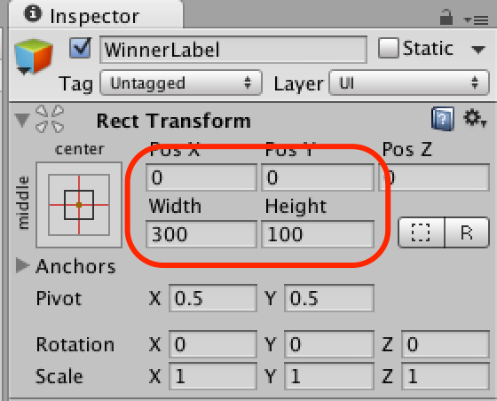

#6.ゲームのクリアを追加する

最後にゲームのクリア条件を追加しましょう。
最後の機能は「ゲーム内のアイテムを全て回収したら「YOU WIN」の文字が表示される」機能です。

この機能を実現する為の必要な要素を考えてみましょう。

1.  ゲームクリアを表す文字
2.  アイテムが全て無くなった判定

では作成していきましょう。

##クリア時のUIを作成

###ラベルの作成

まずはクリア時のUIを表示します。

1.  HierarchyビューのCreateをクリックします。
2.  UI＞Textを選択します。
3.  作成したTextの名前をInspectorビューで「Winner Label」と変更します。


###ラベルの設定

続いてWinnerLabelオブジェクトの内容を設定します。

1.  HierarchyビューでWinnerLabelオブジェクトを選択します。
2.  InspectorビューでRectTransformの値を以下の値に設定します。  
(PosX:0, PosY:0, Width:300, Height:100)
3.  TextコンポーネントのTextを「YOU WIN」に変更します。
4.  TextコンポーネントのFontSizeを60に設定します。




##クリア条件の設定

続いてGameControllerに少し手を加えてクリア条件を設定します。

今回のゲームではアイテムを全て回収するする（残りのアイテムが0になる）事が勝利条件ですので、Itemが見つからなかったら勝利とします。

1.  ProjectブラウザでGameController.csをダブルクリックし、  
Monodevelopを起動します。
2.  コードを以下のように修正します。

```
using UnityEngine;
using System.Collections;

public class GameController : MonoBehaviour
{
	public  UnityEngine.UI.Text scoreLabel;

	public void Update ()
	{
		int count = GameObject.FindGameObjectsWithTag ("Item").Length;
		scoreLabel.text = count.ToString ();

		if (count == 0) {
			// クリア時の処理
		}
	}
}
```

##クリア時のラベルの表示

最後にクリア時に初めて「YOU WIN」の文字が表示されるようにします。

###GameControllerからWinnerLabelへの参照を設定

今回もWinner Labelへの参照が必要ですが、今までと同様にエディター側で設定してしまいます。

1.  GameController.csをMonodevelopで開きます。
2.  コードを以下のように修正します。

```
using UnityEngine;
using System.Collections;

public class GameController : MonoBehaviour
{
	public  UnityEngine.UI.Text scoreLabel;
	public GameObject winnerLabelObject;

	public void Update ()
	{
		int count = GameObject.FindGameObjectsWithTag ("Item").Length;
		scoreLabel.text = count.ToString ();

		if (count == 0) {
			// クリア時の処理
		}
	}
}
```

設定後、Unityエディタへ戻り、GameControllerからWinnerLabelへの参照を構築します。

1.  HierarchyビューでGameControllerを選択します。
2.  HierarchyビューのWinnerLabelをInspectorビューのGameControllerコンポーネントのwinner Label Objectへドラッグ＆ドロップします。


###「YOU WIN」を非表示にする

次はYOU WINを非表示にします。

Unityで描画されているものを非表示にする方法は幾つかありますが、今回はGameObjectを非アクティブにする事で非表示にします。

1.  HierarchyビューでWinnerLabelを選択します。
2.  Inspectorビューでオブジェクトのチェックを外します。


###「クリア時に「YOU WIN」と表示する

クリア時に非アクティブの「Winner Label」をアクティブにすることで、ゲームクリア時にYOU WINと表示します。

```
using UnityEngine;
using System.Collections;

public class GameController : MonoBehaviour
{
	public  UnityEngine.UI.Text scoreLabel;
	public GameObject winnerLabelObject;

	public void Update ()
	{
		int count = GameObject.FindGameObjectsWithTag ("Item").Length;
		scoreLabel.text = count.ToString ();

		if (count == 0) {
			// オブジェクトをアクティブにする
			winnerLabelObject.SetActive (true);
		}
	}
}
```

##ゲームをプレイ

ゲームをプレイしてみてください。
Playerを転がしてアイテムを回収し、最後に「YOU WIN」の文字が表示されます。