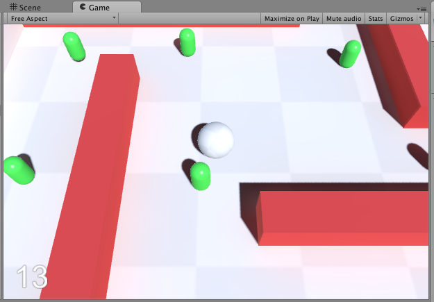

#球転がしゲーム

「玉転がし」のチュートリアルへようこそ！

このチュートリアルでは、Unityの基本機能として提供する単純なモデルやUIだけでゲームを構築し、Unityエディタの簡単な使い方について理解を進めます。

作成するゲームは中央の玉を操作し、範囲内のキューブを回収する、所謂「玉転がし」ゲームです。

機能を分解してみましょう。例えば以下のような機能があります。

*  地面と壁があり、スフィア（玉）の移動範囲を制限します。
*  玉はプレイヤーの操作に従い移動します。
*  周囲にはキューブが複数配置されています。
*  キューブはスフィアが接触すると消えます。
*  キューブ消滅時、スコアが加算されます。
*  全てのキューブを取得すればゲームクリアです。